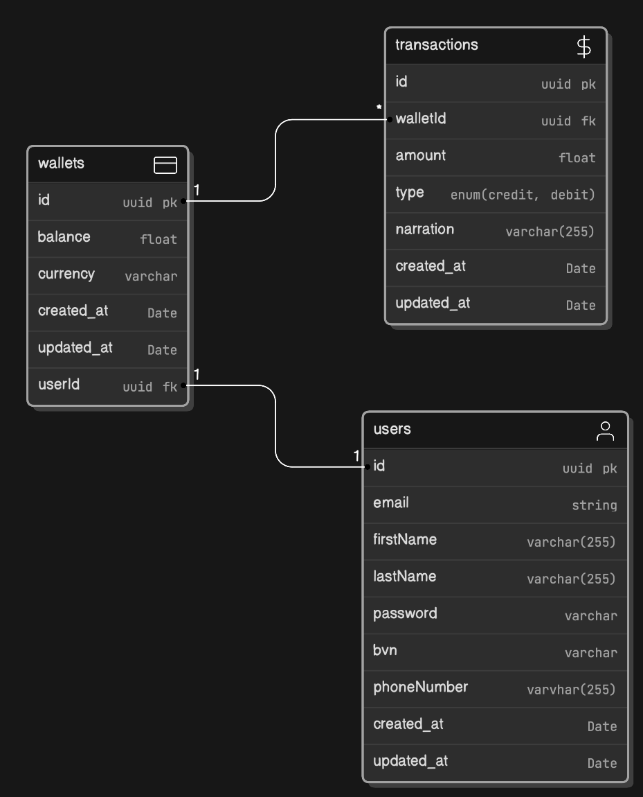

# Wallet Service

The wallet service is a comprehensive platform that provides wallet functionality for Demo Credit to receive loans they have been granted and also send money for repayments.

The API can be accessed through: https://victor-ilodiuba-lendsqr-be-test.onrender.com

## Features

- A user can create an account
- A user can fund their account
- A user can transfer funds to another user’s account
- A user can withdraw funds from their account
- A user with records in the Lendsqr Adjutor [Karma blacklist](https://www.google.com/url?q=https://api.adjutor.io&sa=D&source=editors&ust=1718971153754190&usg=AOvVaw3halHCJit6J6ikXSSYcxz8) would not be onboarded.

## System Architecture

The service is built using a monolithic architecture. All components are tightly coupled and interdependent for simplicity and fast development.

## E-R Diagram

The entity relationship diagram for the database is shown below:

## Getting Started

To run this service, you will require the following:

- Node.js
- Typescript
- MySQL database
- KnexJS ORM

### Setup

- Clone this repository and navigate to the directory.
- Create a `.env` file in the root directory and fill in the environment variables required as stated in the  `.env.example` file.
- Run `npm install` in the project's root directory
- Run `npx knex migrate:latest` in the project's root directory
- If running in a `development` environment, run `npm run dev`, else, run `npm start` in the project's root directory
- Access service from specified port

### Tests

Unit tests for this service are located in the `test` folder. To run unittests, ensure all environment variables are correctly set, then run `npm test` in the project's root directory.

## Service Design & Implementation Documentation

I documented what i have done, specifying the reasons for my approach and decisions i made that influenced the final outcome and it can be at: https://docs.google.com/document/d/1kfPc71BUgyY6l9qPDFtIsQWBJ7FNQCsMPdCYX8DIRbk/edit?usp=sharing

## API Documentation

The Wallet Service API documentation can be found at: https://documenter.getpostman.com/view/27917912/2sA3XVAL89